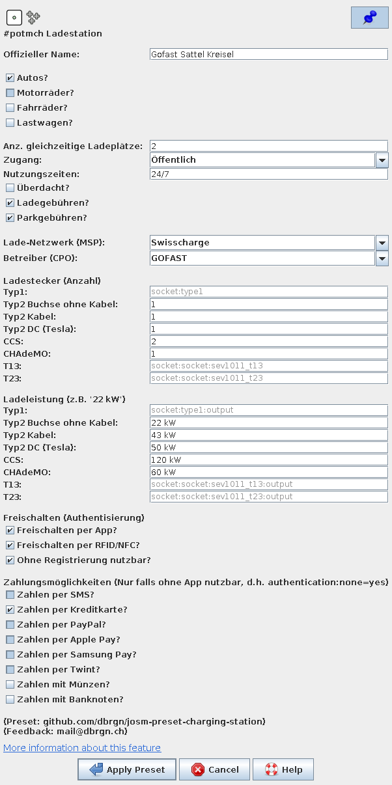

# JOSM Presets for PotmCH

Presets can be added to JOSM through `Edit > Preferences > Tagging Presets >
+`. After adding the preset with the URL, make sure to restart JOSM.

Then, use the preset after selecting a node by going to `Presets > [Preset name]`.

Once the form opens, if you click on the pin icon in the top right corner,
you'll get a corresponding icon directly in the main toolbar.

## Charging Stations ("#potmch Ladestation")

The preset is used to map [charging stations for electric
vehicles](https://wiki.openstreetmap.org/wiki/DE:Project_of_the_month_Switzerland/Charging_Stations).

**URL**

    https://raw.githubusercontent.com/dbrgn/josm-preset-potmch/main/preset_charging_stations.xml

**Screenshot**

